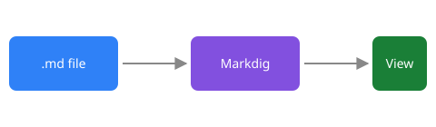

# Another document

You reached this file through a relative link. [Back to the tour](../sample.md).

This image is referenced with a parent-relative path (`../images/diagram.svg`):

## Section one

Some text.

## Section two

The link in the tour jumped straight here.
